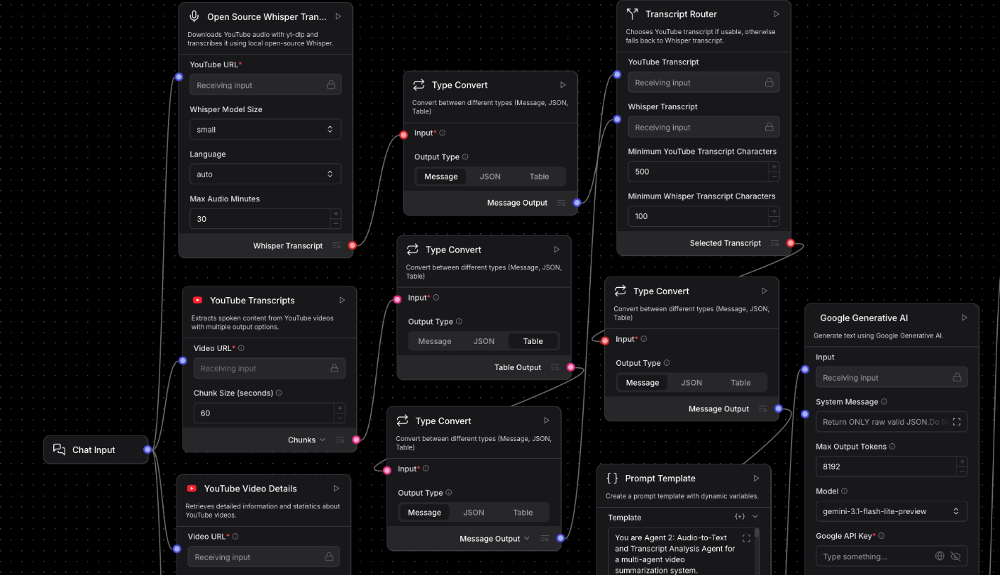
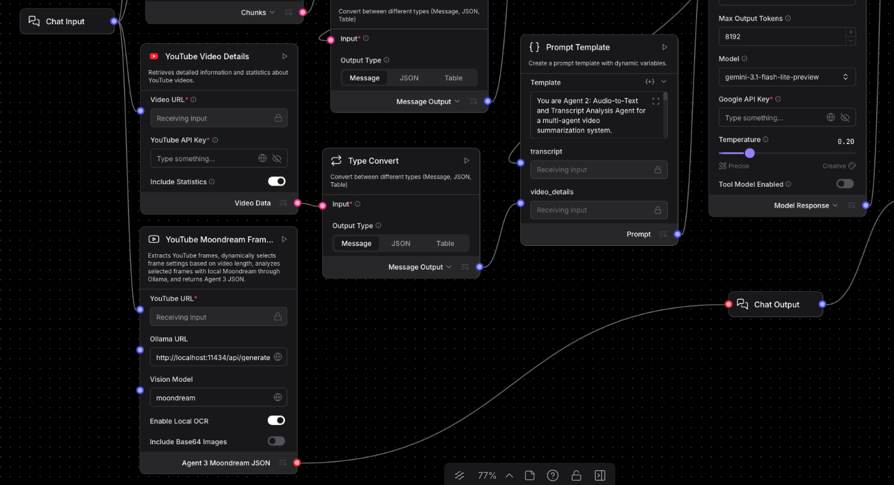
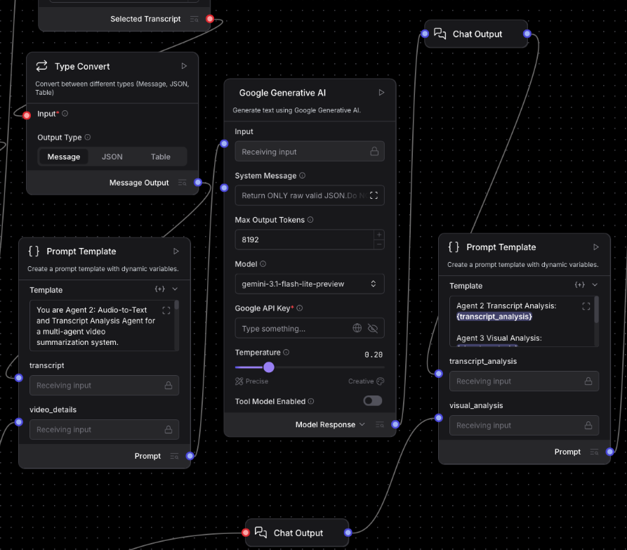
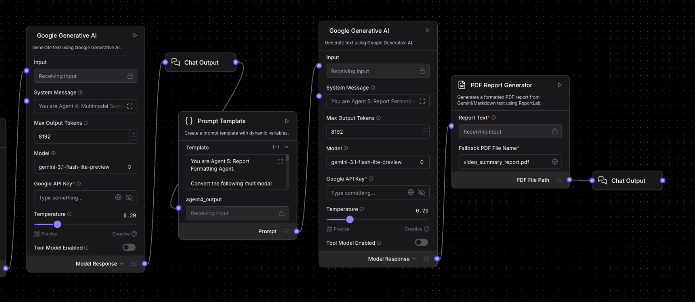

# Video Summarization Multi-Agent System

An advanced Langflow-based Multi-Agent AI System for multimodal YouTube video understanding and automated report generation.

This project combines transcript analysis, OCR, visual frame understanding, multimodal reasoning, and LLM-powered summarization to generate detailed structured PDF reports from long-form video content.

Built using Python, Langflow, Gemini APIs, YouTube Data API v3, OCR pipelines, and multimodal AI agents.

## 🌟 Features

- Multi-agent AI workflow architecture
- YouTube transcript extraction
- Automatic fallback handling for missing captions
- Frame extraction from videos
- OCR-based visual text detection
- Visual scene understanding using multimodal models
- Transcript summarization and key point extraction
- Multimodal reasoning across audio + visuals
- Structured JSON communication between agents
- Automated PDF report generation
- Timestamped insights and important segments
- Modular and scalable Langflow pipeline
- Production-oriented workflow design

## System Architecture

The system is composed of specialized AI agents that work together sequentially:

```text
YouTube Video
      ↓
Agent 1 → Transcript Extraction & Analysis
      ↓
Agent 2 → Structured Insight Extraction
      ↓
Agent 3 → Frame Extraction, OCR & Visual Understanding
      ↓
Agent 4 → Multimodal Fusion & Contextual Summarization
      ↓
Agent 5 → Automated PDF Report Generation
      ↓
Final Multimodal Summary Report
```

### Agents 1 & 2 - Transcript Processing


### Agent 3 - Visual Analysis


### Agent 4 - Multimodal Summarization


### Agent 5 - PDF Report Generation


## 🧰 Technologies Used 

### Core Stack

- Python
- Langflow
- LangChain
- LangGraph
- Gemini API
- YouTube Data API v3

### AI/ML Components

- Multimodal LLMs
- OCR Pipelines
- Whisper (Fallback Transcription)
- Ollama Moondream Vision Model
- Structured Prompt Engineering

### Data & Processing

- JSON Schema Validation
- Conditional Routing
- Deterministic Prompting
- Automated Report Formatting

### PDF Generation

- ReportLab
- Markdown to Report Workflows

## 🚀 Project Workflow
### Agent 1 - Transcript Extraction & Analysis

#### Responsible for:

- Extracting video transcripts
- Summarizing transcript content
- Detecting key arguments
- Identifying recurring topics
- Extracting actionable insights
- Generating structured transcript JSON

#### Outputs:

- Transcript summary
- Key arguments
- Main points
- Important transcript segments
- Recurring topics
- Actionable insights
- Limitations

### Agent 2 — Structured Insight Extraction

#### Responsible for:

- Cleaning transcript outputs
- Structuring extracted insights
- Enforcing strict JSON schema validation
- Handling malformed responses
- Preparing downstream agent inputs

#### Key Focus:

- Reliability
- Schema consistency
- Deterministic formatting
- Structured communication between agents

### Agent 3 - Frame Extraction, OCR & Visual Understanding

#### Responsible for:

- Extracting frames from YouTube videos
- Running OCR on important frames
- Detecting text, slide titles, code, diagrams, and charts
- Performing image-to-text reasoning
- Selecting important visual moments

#### Features:

- Timestamped frame extraction
- OCR-based understanding
- Moondream visual reasoning
- Adaptive frame interval handling
- Multimodal visual analysis

### Agent 4 - Multimodal Fusion & Contextual Summarization

#### Responsible for:

- Combining transcript insights with visual insights
- Performing multimodal reasoning
- Eliminating redundant information
- Generating comprehensive contextual summaries

#### Outputs:

- Unified multimodal summary
- Cross-modal insights
- Final takeaways
- Important transcript + visual correlations
- Context-aware conclusions

### Agent 5 - Automated PDF Report Generation

#### Responsible for:

- Video information
- Executive summary
- Key insights
- Transcript analysis
- Visual analysis
- Multimodal findings
- Limitations
- Final takeaways

#### Output Format:

```
<VideoTitle>_summary_report.pdf
```

## Report Sections

- Video Metadata
- Executive Summary
- Key Points
- Transcript-Based Insights 
- Visual-Based Insights
- Multimodal Analysis
- Limitations
- Final Takeaways